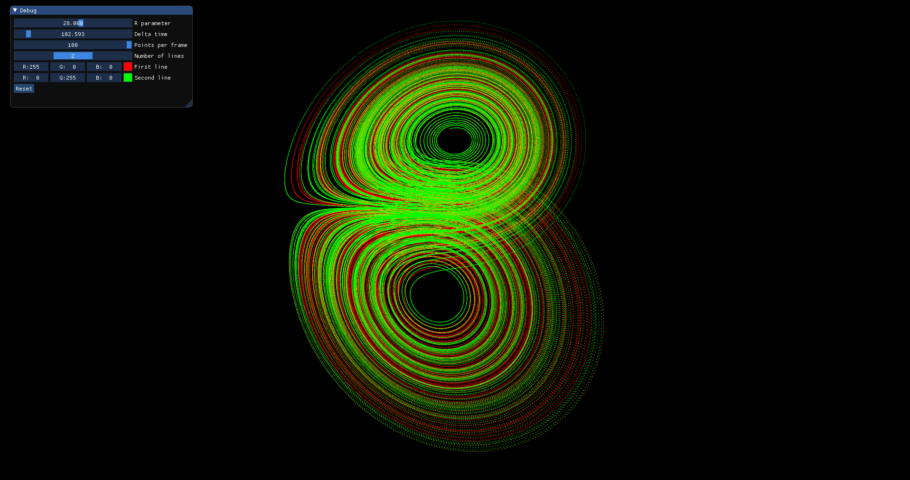
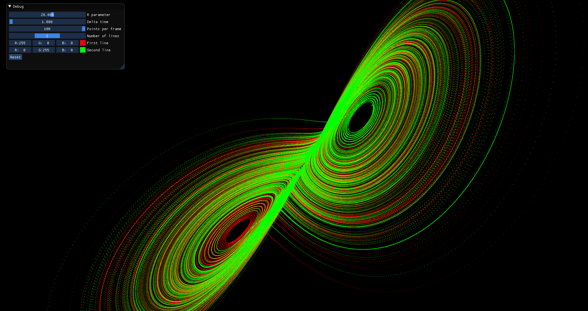

# Lorenz attractor model
This is a fun project made to picture a beauty of butterfly effect with strange Lorenz attractor. 
Done in C++ using OpenGL 3.3 and ImGui.

One probably will have hard time compiling and launching it as the project was done purely for fun and practice. 
So here are some examples:  
(Look better in full size) 

